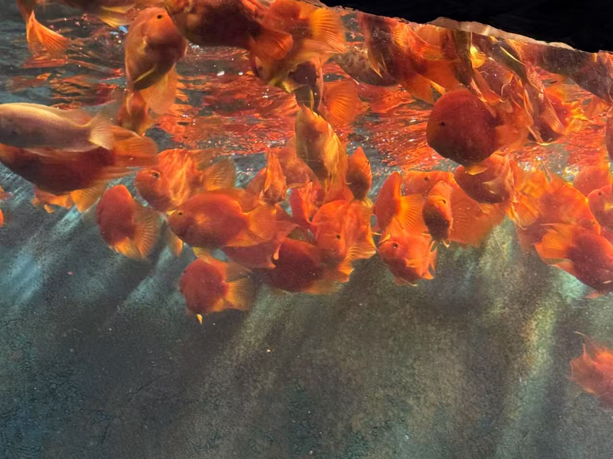
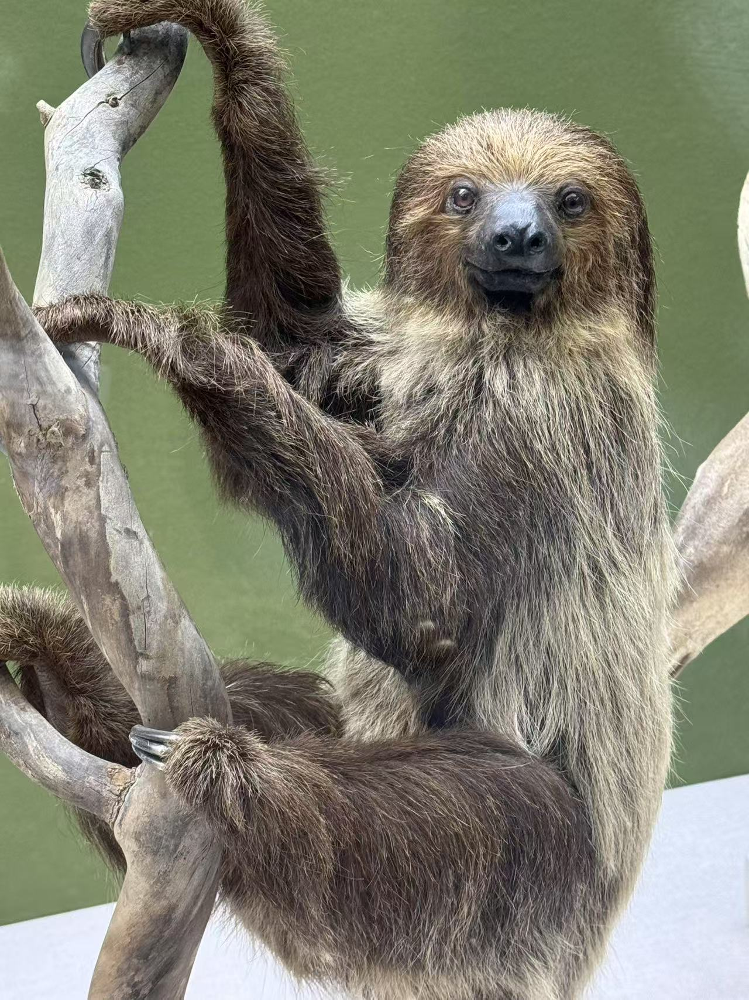
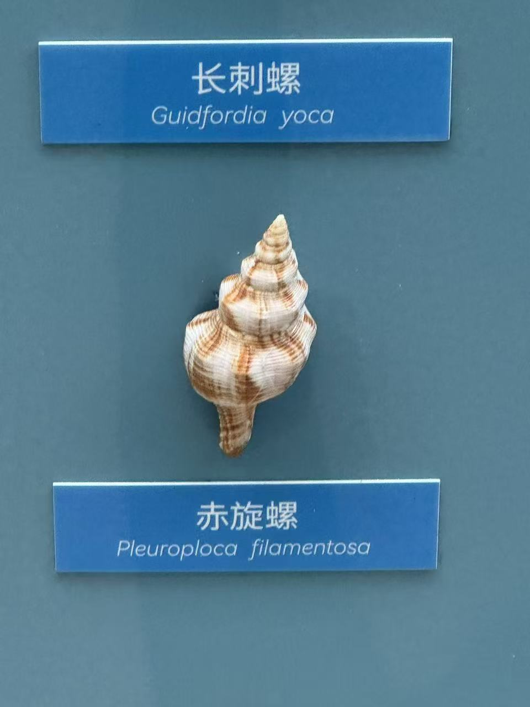
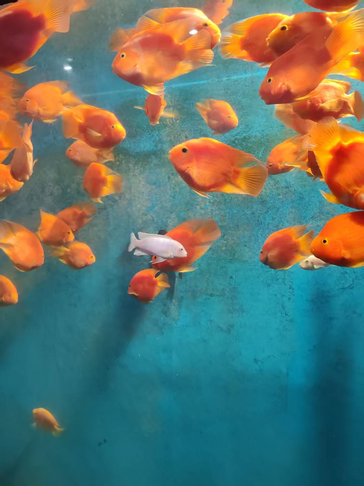
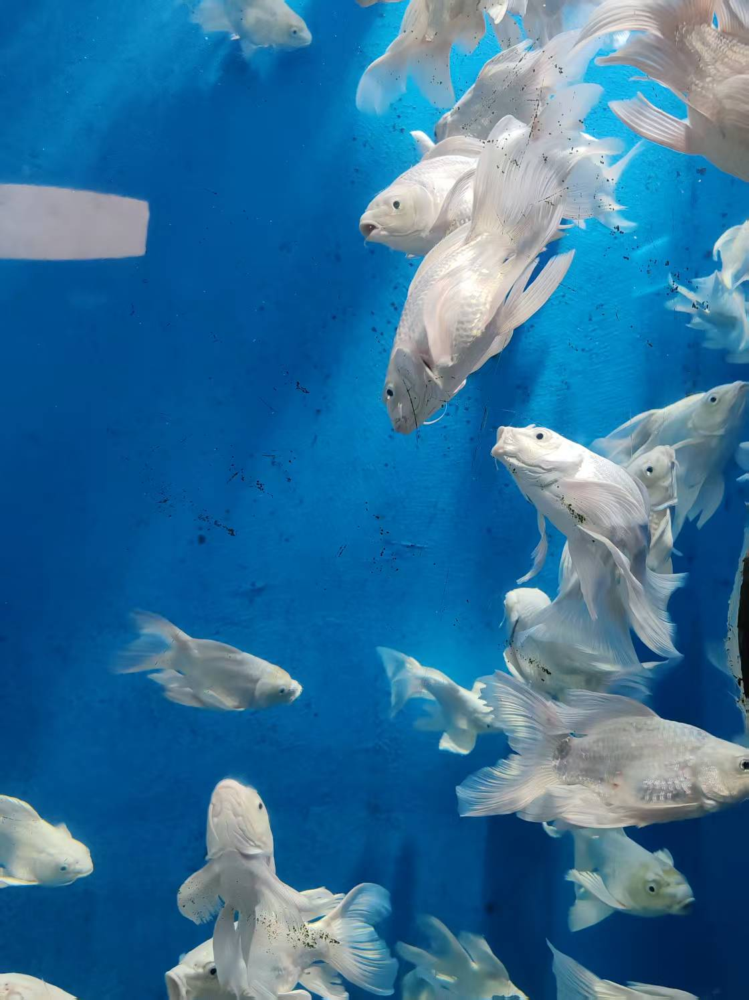
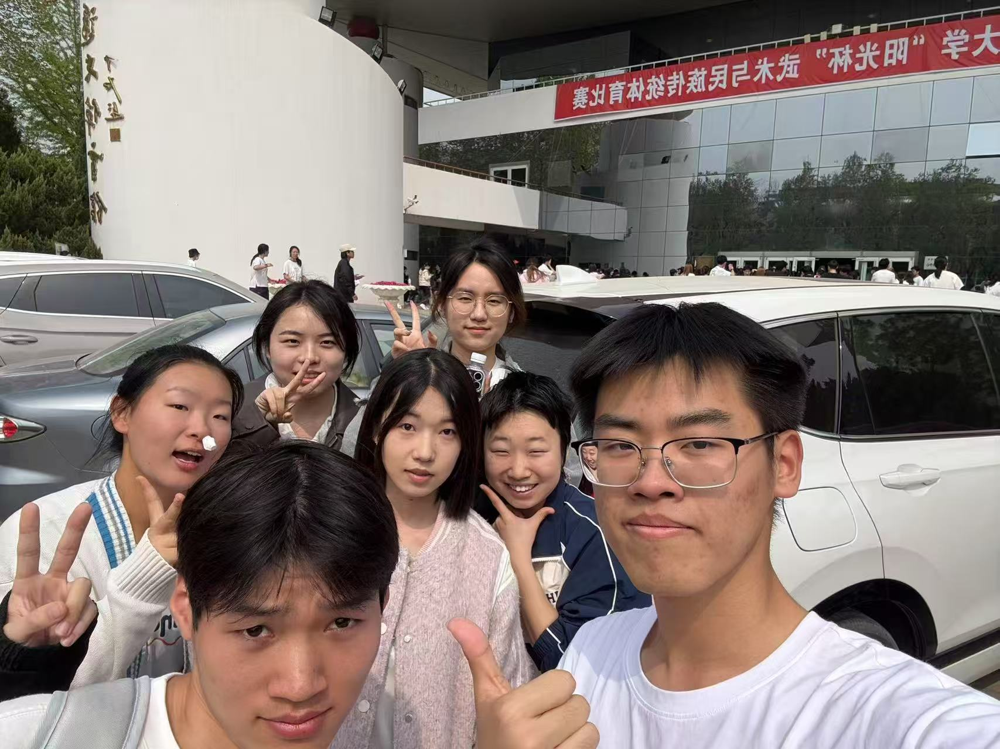

Looking our eyes, tell us! Tell us why！

## 这里也可以找到我们~

<ul>

<li>{{website.sitename }}：<a href="{{ website.url }}" target="_blank">@{{ website.name }}</a></li>


<li>
微信公众号： 

</li>

</ul>

## Keywords


### {{ skill.name }}


<button class="btn btn-outline" type="button">{{ keyword }}</button>




## Photo Wall

<!-- 在以下的 div 中添加 img 即可在照片墙中添加内容 -->

  
  
  
  
  
  
  
  
  
  
  
  
  
  
  
  
  
  
  

